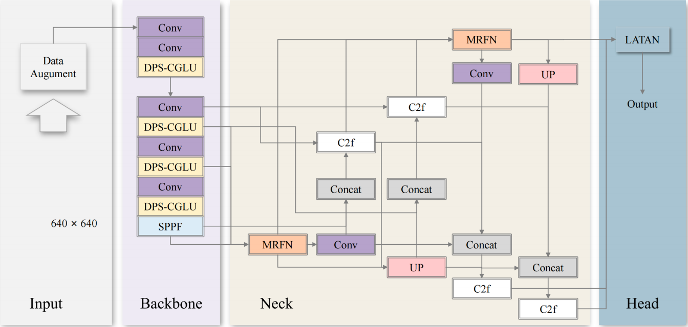

---

# YOLO-DML: Enhancing Object Detection with a Lightweight Adaptive Multi-Scale Fusion Model
Note: This code is directly related to the manuscript titled "Enhancing Object Detection: A Lightweight Adaptive Multi-Scale Fusion Model (YOLO-DML)" that is currently being submitted to The Visual Computer. Please refer to the manuscript for a detailed explanation of the approach and experimental results.
## Paper Information

**Title**: Enhancing Object Detection: A Lightweight Adaptive Multi-Scale Fusion Model (YOLO-DML)
**Authors**:
Zhixian Chen, Yi Wang, Jing Li, Meiting Zhu, Yuhang Zhang, Wenhao Zhang, Ziying Gao, Mingjun Wen, Jianwei Zhang
**Affiliations**:

1. Department of Computer Science and Technology, Taiyuan University, Taiyuan, 030021, China.
2. Department of Mechanics and Vehicle Engineering, Taiyuan University, Taiyuan, 030021, China.
3. Technical Aspects of Multimodal Systems (TAMS), University of Hamburg, Vogt-Kölln-Straße 30, 22537, Hamburg, Germany.
   **Corresponding Author**: Jianwei Zhang ([zhang@informatik.uni-hamburg.de](mailto:zhang@informatik.uni-hamburg.de))
   **Contributing Authors**: Zhixian Chen ([chenzhixian620@163.com](mailto:chenzhixian620@163.com)), Yi Wang ([wy371952@gmail.com](mailto:wy371952@gmail.com)), Jing Li ([lijing@tyu.edu.cn](mailto:lijing@tyu.edu.cn)), Meiting Zhu ([abcd298396@qq.com](mailto:abcd298396@qq.com)), Yuhang Zhang ([254954476@qq.com](mailto:254954476@qq.com)), Wenhao Zhang ([2482416363@qq.com](mailto:2482416363@qq.com)), Ziying Gao ([2051288014@qq.com](mailto:2051288014@qq.com)), Mingjun Wen ([wenmj88@126.com](mailto:wenmj88@126.com))

**Journal**: The Visual Computer
**Link to Paper**: \[待填写]

## Abstract

Object detection is a pivotal task in computer vision, demanding precise annotation of object boundaries for environmental perception and real-time data processing. Traditional methods, relying on manually designed features, often suffer from high computational complexity and limited generalization. Deep learning-based approaches, particularly YOLO (You Only Look Once), have shown promise by automating feature learning. However, challenges remain in enhancing detection accuracy while maintaining model efficiency.

This paper introduces YOLO-DML, a lightweight adaptive multi-scale cross-layer fusion model, designed to improve object detection performance and reduce model parameters. By integrating dynamic convolution generation with positional encoding in the backbone network, YOLO-DML enhances feature extraction flexibility. The neck network employs multi-scale feature fusion and an edge attention mechanism for efficient feature alignment. A lightweight adaptive task alignment detection head is proposed to aid precise localization and classification. Experimental results on three open-source datasets demonstrate that YOLO-DML achieves improvements in mAP50 of 3.1%, 3.6%, and 1.6% compared to YOLOv8, striking an excellent balance between accuracy and speed. This ensures efficient operation on edge devices, crucial for tasks like high-speed navigation and robust identification.

## YOLO-DML Overall Architecture



## Performance

Below is the performance comparison of YOLO-DML against other YOLO versions on three datasets: **VisDrone2019**, **NEU-DET**, and **GC10-DET**.

| Dataset          | Method   | Precision (%) | Recall (%) | mAP50 (%) | mAP50-95 (%) | Size (MB) | Parameters (M) | AP (%) | S (%) | M (%) | L (%) |
| ---------------- | -------- | ------------- | ---------- | --------- | ------------ | --------- | -------------- | ------ | ----- | ----- | ----- |
| **VisDrone2019** | YOLOv8   | 43.4          | 33.6       | 33.7      | 19.6         | 5.97      | 2.87           | 9.6    | 28.1  | 37.1  |       |
|                  | YOLOv10  | 44.6          | 34.3       | 34.6      | 19.9         | 5.5       | 2.59           | 10.0   | 28.1  | 34.4  |       |
|                  | YOLOv11  | 43.1          | 33.4       | 33.4      | 19.4         | 5.23      | 2.47           | 9.6    | 27.6  | 34.9  |       |
|                  | YOLOv12  | 43.5          | 33.1       | 32.5      | 18.8         | 5.5       | 2.55           | 10.0   | 27.0  | 35.6  |       |
|                  | YOLO-DML | 47.7          | 36.2       | 36.8      | 21.8         | 5.14      | 2.44           | 11.2   | 31.3  | 42.2  |       |
| **NEU-DET**      | YOLOv8   | 72.0          | 73.8       | 75.9      | 41.0         | 6.3       | 2.87           | 32.4   | 38.5  | 42.2  |       |
|                  | YOLOv10  | 71.2          | 69.0       | 73.8      | 40.0         | 5.53      | 2.59           | 35.5   | 34.6  | 45.9  |       |
|                  | YOLOv11  | 72.2          | 74.8       | 77.8      | 40.9         | 5.27      | 2.47           | 35.5   | 35.2  | 54.4  |       |
|                  | YOLOv12  | 71.1          | 72.3       | 75.0      | 40.5         | 5.6       | 2.55           | 35.2   | 35.2  | 47.7  |       |
|                  | YOLO-DML | 74.4          | 76.6       | 79.5      | 44.6         | 5.15      | 2.44           | 41.3   | 34.5  | 60.9  |       |
| **GC10-DET**     | YOLOv8   | 75.6          | 59.8       | 66.6      | 35.2         | 6.2       | 2.87           | 28.9   | 34.2  |       |       |
|                  | YOLOv10  | 61.8          | 53.4       | 56.3      | 31.0         | 5.5       | 2.59           | 27.9   | 30.4  |       |       |
|                  | YOLOv11  | 65.0          | 70.5       | 68.0      | 35.5         | 5.24      | 2.47           | 27.8   | 35.5  |       |       |
|                  | YOLOv12  | 64.3          | 63.2       | 65.3      | 35.5         | 5.24      | 2.55           | 28.3   | 35.6  |       |       |
|                  | YOLO-DML | 67.1          | 67.3       | 68.2      | 36.6         | 5.4       | 2.44           | 26.2   | 35.6  |       |       |

## 2. Prepare Dataset

### VisDrone2019

You can download the dataset from the following link:

* **Dataset File**: [dataset\_visdrone.zip](https://pan.baidu.com/s/1N2494VB8IsJ-7hCklZjZ1A?pwd=fa3z)
* **Password**: fa3z
* **Shared by**: Baidu Netdisk Super Member v6

### GC10-DET

You can download the dataset from the following link:

* **Dataset File**: [dataset\_visdrone.zip and 2 other files](https://pan.baidu.com/s/1jw-BIaCMPPBf1mfWDDn--g?pwd=ynnt)
* **Password**: ynnt
* **Shared by**: Baidu Netdisk Super Member v6

### NEU-DET

You can download the dataset from the following link:

* **Dataset File**: [NEU-DET](https://pan.baidu.com/s/1vA0XDkXt_sSnoBqt4q7QCg?pwd=ijts)
* **Password**: ijts
* **Shared by**: Baidu Netdisk Super Member v6

## 3. Create Environment

### Installation

This project uses **Ultralytics version 8.3.9**. The required environment is:

* **Python**: 3.10.14
* **PyTorch**: 2.2.2+cu121
* **TorchVision**: 0.17.2+cu121
* **Timm**: 1.0.7
* **MMCV**: 2.2.0
* **MMEngine**: 0.10.4

To create the environment, use the following commands:

```bash
conda env create -f environment.yml
conda activate yolo-dml
```

### Additional Installation

You will also need to install some additional packages:

```bash
pip install timm==1.0.7 thop efficientnet_pytorch==0.7.1 einops grad-cam==1.5.4 dill==0.3.8 albumentations==1.4.11 pytorch_wavelets==1.3.0 tidecv PyWavelets opencv-python prettytable -i https://pypi.tuna.tsinghua.edu.cn/simple
pip install -U openmim -i https://pypi.tuna.tsinghua.edu.cn/simple
mim install mmengine -i https://pypi.tuna.tsinghua.edu.cn/simple
mim install "mmcv>=2.0.0" -i https://pypi.tuna.tsinghua.edu.cn/simple
```

### Compilation

To compile the necessary modules, run the following command:

```bash
sh YOLO-DML/ultralytics/nn/extra_modules/cutlass/examples/19_large_depthwise_conv2d_torch_extension/make.sh
```

---

如果你还有更多内容需要补充或修改，随时告诉我！
